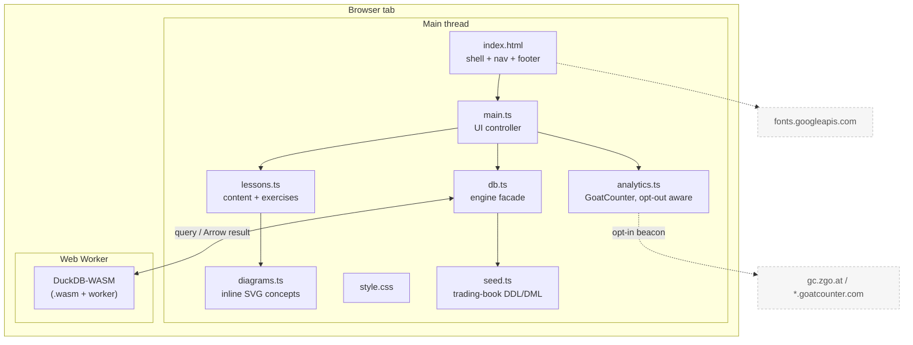
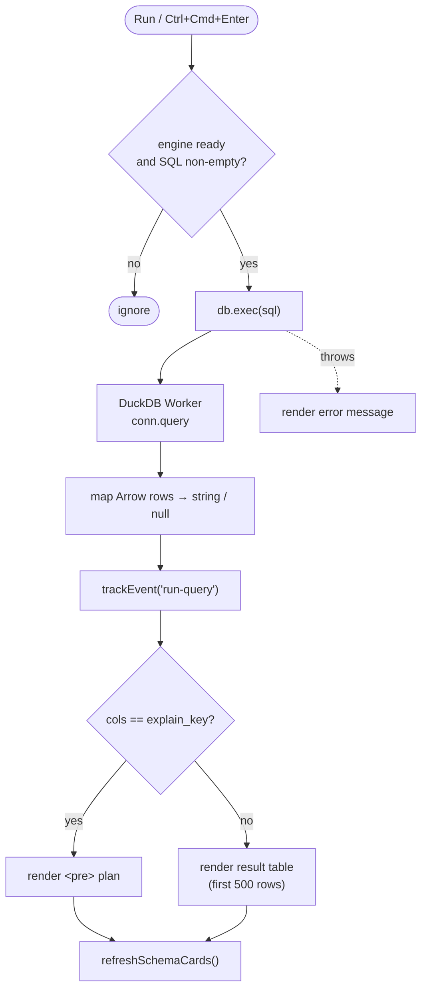
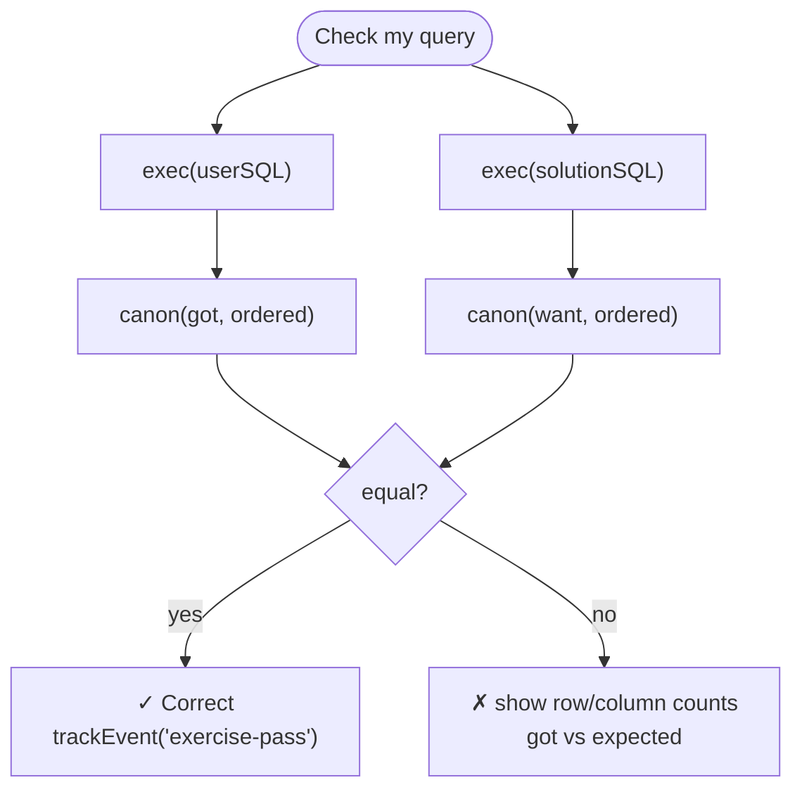
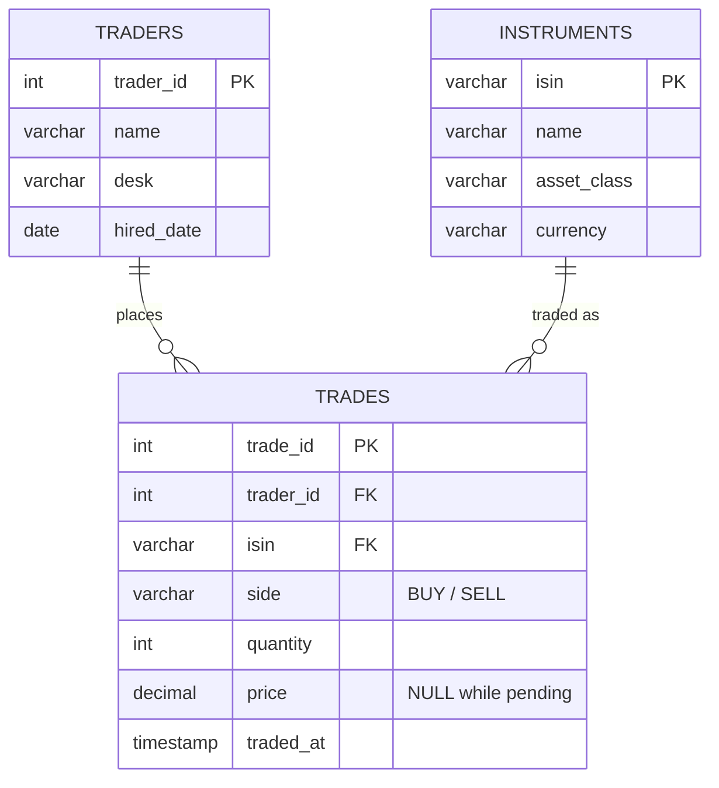
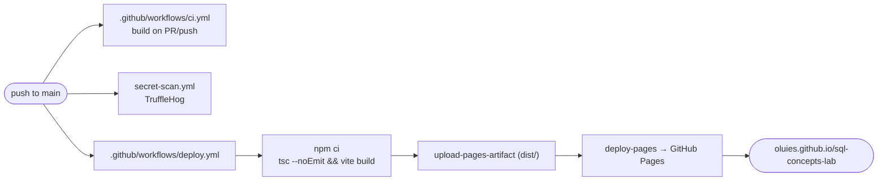

# Architecture

SQL Concepts Lab is a fully client-side single-page application. There is no
server, no API and no database to provision: the DuckDB query engine, the sample
data and the exercise checker all run inside the browser tab via WebAssembly. The
only network traffic after the initial asset load is Google Fonts and (optionally)
a single privacy-respecting analytics beacon.

## Component overview



`main.ts` is the only stateful controller. It owns the navigation, the editor,
the result rendering and the exercise verdict. `db.ts` is a thin facade over
DuckDB-WASM that hides bundle selection, worker creation and result
materialization. Everything else is data (`lessons.ts`, `seed.ts`,
`diagrams.ts`) or a cross-cutting concern (`analytics.ts`, `style.css`).

## Module dependencies

```mermaid
graph LR
  main.ts --> style.css
  main.ts --> lessons.ts
  main.ts --> db.ts
  main.ts --> analytics.ts
  lessons.ts --> diagrams.ts
  db.ts --> seed.ts
  db.ts --> duckdb["@duckdb/duckdb-wasm"]
```

The graph is acyclic and shallow: `main.ts` is the single composition root, the
data modules have no dependencies of their own except `lessons.ts → diagrams.ts`,
and only `db.ts` touches the third-party engine.

## Startup sequence

The UI renders immediately from static lesson content; the engine boots
asynchronously and the Run/Check buttons stay disabled until it is ready.

```mermaid
sequenceDiagram
  participant U as User
  participant M as main.ts
  participant A as analytics.ts
  participant D as db.ts
  participant W as DuckDB Worker

  U->>M: load page
  M->>A: initAnalytics()
  Note over A: no-op if DNT/GPC set<br/>or no GoatCounter code
  M->>M: buildNav() + show("select")
  Note over M: lessons render at once;<br/>Run/Check disabled
  M->>D: boot()
  D->>D: selectBundle(MVP / EH)
  D->>W: new Worker + instantiate(.wasm)
  D->>W: seed() — load trading book
  D->>W: PRAGMA version
  W-->>D: version string
  D-->>M: resolve(version)
  M->>M: enable Run/Check, show "DuckDB <v> · in-browser"
  M->>D: refreshSchemaCards()
```

If `boot()` rejects, the status line shows "engine failed to load" and an error
is rendered in the output panel instead of enabling the controls.

## Query execution

Every "Run" press routes through the same path. Results are materialized from
Arrow into plain string/`null` cells by `db.ts`, so the UI never touches Arrow
types directly. `EXPLAIN` output is detected by its column shape and rendered as
a plan instead of a table.



## Exercise checking

Exercises are verified by structural result equality, not by string-matching the
query. The learner's query and the reference solution are both executed, then
canonicalized: column names are lowercased and rows are JSON-encoded and sorted
(unless the exercise is order-sensitive, in which case row order is preserved).



This lets multiple correct phrasings (e.g. a join vs. a subquery) all pass, while
still catching wrong results.

## Sample data model

The seed is a small trading book with deliberate gaps that the join and NULL
lessons rely on: trader David Ek has no trades, instrument *EIB FRN 2031* has
never traded, and two trades have a `NULL` price (pending confirmation).



The relationships are conceptual: `trades` carries `trader_id` and `isin`
columns, but the seed defines no foreign-key constraints, which is what makes the
anti-join / orphan-row lessons meaningful.

## Build and deploy



Vite bundles the DuckDB `.wasm` modules and workers from the npm package via
`?url` imports, so the deployed site has no runtime CDN dependency for the engine
itself. `vite.config.ts` sets `base: "./"`, so the build works unchanged under
the project-pages subpath. Dependabot keeps the npm and GitHub Actions
dependencies current on a weekly schedule.

## Design notes

- **No framework.** The DOM is built with direct `innerHTML` and a handful of
  event handlers in `main.ts`. The app is small enough that a framework would add
  more weight (and a larger WASM-plus-runtime payload) than it saves.
- **Engine on a worker.** DuckDB runs in a Web Worker, so long queries never
  block the UI thread. `db.ts` selects the EH (exception-handling) bundle where
  supported and falls back to MVP.
- **Content as data.** Lessons, examples and exercises are plain TypeScript
  objects in `lessons.ts`. Adding a lesson is a data edit, not a code change.
- **Privacy by construction.** `analytics.ts` is a no-op unless a GoatCounter
  code is configured, and it bails out entirely when the browser signals Do Not
  Track or Global Privacy Control. Only lesson paths and two coarse event names
  are ever sent — never query text. See the README's Privacy section.
```
